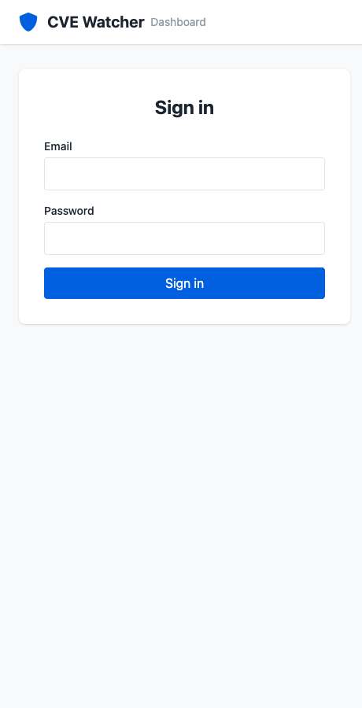
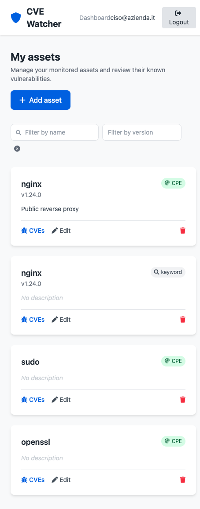
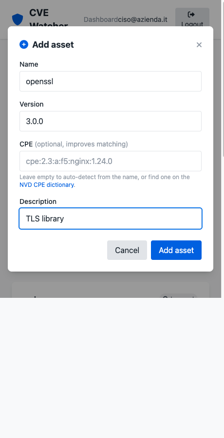
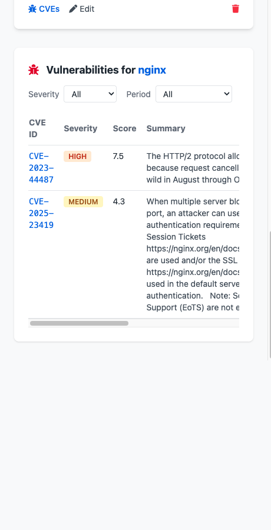

# CVE Watcher

A FastAPI-based application for monitoring and tracking CVE (Common Vulnerabilities and Exposures) vulnerabilities for your software assets.

## Overview

CVE Watcher helps organizations and developers monitor their software assets for security vulnerabilities by:

- **Asset Management**: Track your software components, versions, and CPE identifiers
- **CVE Monitoring**: Automatically monitor for new vulnerabilities affecting your assets
- **Real-time Alerts**: Get notified when new CVEs are discovered for your tracked software
- **Vulnerability Reports**: Generate detailed reports on security issues affecting your infrastructure
- **User Management**: Secure user authentication and authorization

## Features

- 🔐 **User Authentication**: Secure JWT-based authentication system
- 📦 **Asset Tracking**: Manage your software inventory with detailed metadata
- 🔍 **CVE Monitoring**: Integration with NIST NVD for real-time vulnerability data
- 📊 **Severity Filtering**: Filter vulnerabilities by severity level (Critical, High, Medium, Low)
- 📈 **Reporting**: Generate monitoring reports and vulnerability summaries
- 🎯 **Targeted Scanning**: Monitor specific assets or scan all assets at once
- 🔄 **Real-time Updates**: Automatic vulnerability detection and updates
- ⏰ **Background Monitoring**: Optional scheduler that periodically scans every asset
- 🔔 **Notifications**: Alert on newly discovered vulnerabilities (console and webhook)
- 🖥️ **Web Dashboard**: Single-page UI to manage assets and review vulnerabilities

## Web Dashboard

A self-contained web dashboard is served at [`/dashboard`](http://localhost:8000/dashboard).
It requires no build step (vanilla JS + Tailwind via CDN) and lets you:

- Sign in with your CVE Watcher credentials (the JWT is kept in `localStorage`).
- Add assets with name, version, CPE and description.
- Browse your asset inventory, **filter it by name and version**, and **edit**
  or delete each entry inline.
- Inspect the vulnerabilities of an asset, filtered by a **time period**
  selector (All time, last 30/90/365 days) and by **severity**
  (Critical/High/Medium/Low). Each finding shows the CVE id (linked to MITRE),
  a colour-coded severity badge, CVSS score and summary.

If the NIST NVD service cannot be reached, the dashboard shows an explicit
warning banner instead of an empty list — an empty result is only displayed
when NVD genuinely reports no matching CVEs.

### Screenshots

| Sign in | Asset inventory |
| --- | --- |
|  |  |

| Add an asset | Vulnerabilities for an asset |
| --- | --- |
|  |  |

The card badges tell you how an asset is matched: a green **CPE** badge means a
precise CPE lookup, a grey **keyword** badge means name-based matching.

## How Vulnerability Matching Works

CVE Watcher resolves the vulnerabilities of an asset in one of three ways,
chosen automatically per asset:

### 1. CPE lookup (precise, preferred)

When an asset declares a **CPE 2.3** identifier (e.g.
`cpe:2.3:a:f5:nginx:1.24.0`), the query is delegated to NVD's `cpeName`
filter. NVD evaluates the version ranges declared in every CVE configuration
server-side, so the result contains exactly the CVEs that affect that product
and version. Partial CPEs are padded to the full 13-component form before the
lookup. This path avoids both the keyword 100-result cap and the false
positives/negatives of free-text search.

### 2. Automatic CPE resolution (when no CPE is given)

If an asset has no CPE, CVE Watcher first tries to **derive one from the product
name** using NVD's CPE dictionary (`/cpes/2.0`). Matching application CPEs are
collected — following `deprecatedBy` links so historical vendors resolve to
their current names (e.g. `igor_sysoev` → `nginx` → `f5`) — and the asset
version is injected into each. The precise `cpeName` lookup from step 1 is then
run for every resolved vendor/product pair and the results merged. This means a
plain `nginx` / `1.24.0` asset returns the same accurate CVEs as one with an
explicit CPE, without the user having to know the CPE string.

### 3. Keyword search with local filtering (last resort)

When the name cannot be resolved to a CPE, CVE Watcher falls back to an NVD
keyword search and then filters each candidate locally to cut the noise of
free-text matching:

- **Product identity** — a candidate is kept only if one of its affected-product
  CPEs matches the asset name (separator-insensitive exact match), so `nginx`
  no longer matches unrelated products such as `nginx_proxy_manager`.
- **Version range** — if the asset has a version, the candidate must declare a
  version range (or exact CPE version) that actually includes it; CVEs fixed in
  earlier releases are dropped.
- **Text fallback** — when a CVE carries no CPE data at all, the asset name (and
  version, if present) is matched against the CVE summary.

> Tip: providing a CPE explicitly still helps when a product name is ambiguous
> or its vendor differs from the common name (e.g. Apache HTTP Server is
> `cpe:2.3:a:apache:http_server`). Look one up in the
> [NVD CPE dictionary](https://nvd.nist.gov/products/cpe/search).

### Worked examples

What actually happens for three assets monitoring **nginx 1.24.0**:

| Asset input                                                     | Path taken              | What CVE Watcher does                                                                                                                                                 | Result                                                       |
| --------------------------------------------------------------- | ----------------------- | --------------------------------------------------------------------------------------------------------------------------------------------------------------------- | ------------------------------------------------------------ |
| `name=nginx`, `version=1.24.0`, `cpe=cpe:2.3:a:f5:nginx:1.24.0` | **1. CPE lookup**       | Pads the CPE to `cpe:2.3:a:f5:nginx:1.24.0:*:*:*:*:*:*:*` and asks NVD `?cpeName=…`                                                                                   | The CVEs whose configs include 1.24.0                        |
| `name=nginx`, `version=1.24.0`, no CPE                          | **2. Auto resolution**  | Looks `nginx` up in `/cpes/2.0`, finds vendors `nginx` and `f5`, builds `cpe:2.3:a:nginx:nginx:1.24.0:*…` and `cpe:2.3:a:f5:nginx:1.24.0:*…`, queries both and merges | **Same** CVEs as the explicit-CPE asset                      |
| `name=nginx proxy manager`, no CPE                              | **3. Keyword + filter** | Resolution finds no exact `nginx_proxy_manager` application match by that name, falls back to keyword search and filters by product identity + version                | Only CVEs whose affected CPE is really `nginx_proxy_manager` |

For the two nginx assets above, the live NVD data currently returns the same two
findings (sorted by severity):

```json
{
  "asset": {
    "id": "…",
    "name": "nginx",
    "version": "1.24.0",
    "cpe": null,
    "description": "edge reverse proxy"
  },
  "total_vulnerabilities": 2,
  "days_searched": 0,
  "vulnerabilities": [
    {
      "cve_id": "CVE-2023-44487",
      "severity": "HIGH",
      "score": 7.5,
      "summary": "The HTTP/2 protocol allows a denial of service (…the Rapid Reset attack).",
      "relevance_reason": "NVD matched CPE 'cpe:2.3:a:f5:nginx:1.24.0:*:*:*:*:*:*:*'",
      "cve_url": "https://cve.mitre.org/cgi-bin/cvename.cgi?name=CVE-2023-44487"
    },
    {
      "cve_id": "CVE-2025-23419",
      "severity": "MEDIUM",
      "score": 4.3,
      "summary": "When multiple server blocks share the same … TLS session reuse …",
      "relevance_reason": "NVD matched CPE 'cpe:2.3:a:f5:nginx:1.24.0:*:*:*:*:*:*:*'",
      "cve_url": "https://cve.mitre.org/cgi-bin/cvename.cgi?name=CVE-2025-23419"
    }
  ]
}
```

The key takeaway: **you usually only need a name and a version.** Adding a CPE is
an optional precision lever, not a requirement.

## Background Monitoring & Notifications

The application can periodically scan every registered asset against the NIST NVD
and alert on newly discovered vulnerabilities. It is **opt-in** and configured via
environment variables (see `.env.example`):

| Variable                   | Default   | Description                                 |
| -------------------------- | --------- | ------------------------------------------- |
| `MONITOR_ENABLED`          | `false`   | Enable the background scheduler             |
| `MONITOR_INTERVAL_MINUTES` | `360`     | Minutes between scans                       |
| `NOTIFY_CONSOLE`           | `true`    | Log new findings via the application logger |
| `NOTIFY_WEBHOOK_URL`       | _(unset)_ | POST new findings as JSON to this URL       |

When enabled, a scan runs at startup and then on the configured interval; only
newly detected CVEs trigger notifications.

## API Endpoints

### Authentication

- `POST /auth/register` - Register new user
- `POST /auth/login` - User login
- `POST /auth/refresh` - Refresh access token
- `POST /auth/logout` - Logout user

### Asset Management

- `POST /assets/` - Create new asset
- `GET /assets/` - List user's assets
- `GET /assets/{asset_id}` - Get specific asset details
- `PATCH /assets/{asset_id}` - Update asset information
- `DELETE /assets/{asset_id}` - Remove asset

### CVE Monitoring

- `GET /assets/{asset_id}/vulnerabilities` - Get vulnerabilities for specific asset
- `GET /assets/{asset_id}/monitor` - Monitor single asset for CVEs
- `POST /assets/monitoring/scan-all` - Scan all user assets
- `GET /assets/monitoring/report` - Generate monitoring report

### CVE Data

- `GET /cves/fetch-recent` - Fetch and store recent CVEs from NIST NVD
- `GET /cves/recent` - List recently stored CVEs
- `GET /cves/search` - Search CVEs by product (and optional version)
- `GET /cves/vulnerabilities` - Check vulnerabilities across all your assets

### User & Health

- `GET /user` - Get the current user's profile
- `GET /health` - Service health check

### Web UI

- `GET /dashboard` - Single-page web dashboard (assets & vulnerabilities)

## Technology Stack

- **Backend**: FastAPI (Python)
- **Database**: PostgreSQL with SQLAlchemy ORM
- **Authentication**: JWT with joserfc
- **Migration**: Alembic
- **Scheduling**: APScheduler (optional background monitoring)
- **Container**: Docker & Docker Compose
- **External API**: NIST NVD API integration

## Quick Start

### Using Docker (Recommended)

1. Clone the repository:

```bash
git clone https://github.com/mangrisano/cvewatcher.git
cd cvewatcher
```

2. Start the application:

```bash
docker-compose up --build
```

3. Access the API:

- API: http://localhost:8000
- Interactive API docs: http://localhost:8000/docs
- Alternative docs: http://localhost:8000/redoc

## End-to-End Example (curl)

A complete flow from zero to a list of CVEs, using only the API. The same thing
can be done click-by-click in the [dashboard](http://localhost:8000/dashboard).

```bash
BASE=http://localhost:8000

# 1. Register a user
curl -s -X POST "$BASE/auth/register" \
  -H "Content-Type: application/json" \
  -d '{"username":"ciso","email":"ciso@example.com","password":"Password123"}'

# 2. Log in and capture the JWT access token
TOKEN=$(curl -s -X POST "$BASE/auth/login" \
  -H "Content-Type: application/json" \
  -d '{"email":"ciso@example.com","password":"Password123"}' \
  | python3 -c "import sys,json;print(json.load(sys.stdin)['access_token'])")

# 3. Add an asset — just a name and a version, no CPE needed
ASSET=$(curl -s -X POST "$BASE/assets/" \
  -H "Authorization: Bearer $TOKEN" -H "Content-Type: application/json" \
  -d '{"name":"nginx","version":"1.24.0","description":"edge reverse proxy"}' \
  | python3 -c "import sys,json;print(json.load(sys.stdin)['id'])")

# 4. Ask for its vulnerabilities (all time, any severity)
curl -s "$BASE/assets/$ASSET/vulnerabilities" \
  -H "Authorization: Bearer $TOKEN" | python3 -m json.tool
```

You can narrow the result with query parameters:

```bash
# Only HIGH severity, published in the last 365 days
curl -s "$BASE/assets/$ASSET/vulnerabilities?severity=HIGH&days=365" \
  -H "Authorization: Bearer $TOKEN" | python3 -m json.tool
```

| Query parameter | Values                                 | Meaning                                                          |
| --------------- | -------------------------------------- | ---------------------------------------------------------------- |
| `severity`      | `CRITICAL` / `HIGH` / `MEDIUM` / `LOW` | Keep only findings at that severity                              |
| `days`          | integer (e.g. `30`, `90`, `365`)       | Only CVEs published in the last N days; omit or `0` for all time |

> If NVD is unreachable the endpoint returns **HTTP 503** rather than an empty
> list, so an empty `vulnerabilities` array always means "no known CVEs", never
> "the lookup failed".

## Contributing

1. Fork the repository
2. Create a feature branch (`git checkout -b feature/amazing-feature`)
3. Commit your changes (`git commit -m 'Add some amazing feature'`)
4. Push to the branch (`git push origin feature/amazing-feature`)
5. Open a Pull Request

## License

This project is licensed under the [MIT License](LICENSE).

---
